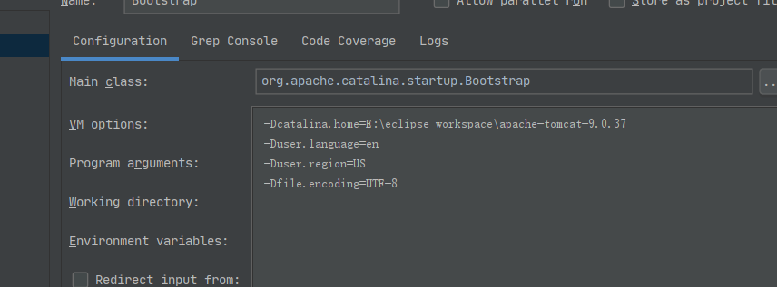

# 运行指南
1. 运行打包
```bash
mvn clean install

```
如图


2. 找到入口类**org.apache.catalina.startup.Bootstrap.main** 并run，会出现乱码，配置启动参数
```bash
-Dcatalina.home=E:\eclipse_workspace\apache-tomcat-9.0.37
-Duser.language=en
-Duser.region=US
-Dfile.encoding=UTF-8
```
